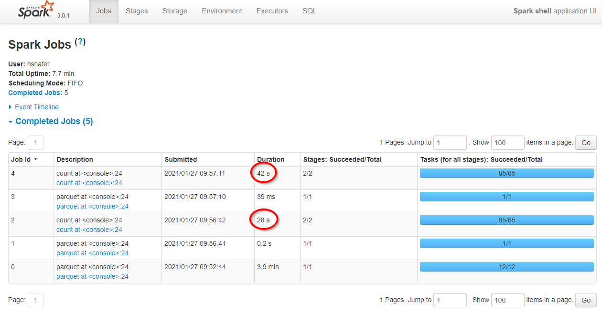

# spark-demo

### Why spark faster than any other distributed computation engine?

Because of DataFrames

Start shell on local machine
```shell
spark-shell --master local[*] --conf spark.driver.memory=4G
```
Execute in the shell
```scala
// generate 300M rows
scala> spark.range( 0, 300000000L).map(_ => java.util.UUID.randomUUID().toString).write.parquet("/tmp/my_data")

// filter as dataframe 
scala> spark.read.parquet("/tmp/my_data").where($"value".startsWith("ee")).count
res1: Long = 1170304

// filter as Row
scala> spark.read.parquet("/tmp/my_data").filter(_.getString(0).startsWith("ee")).count
res2: Long = 1170304
```
<br/>


